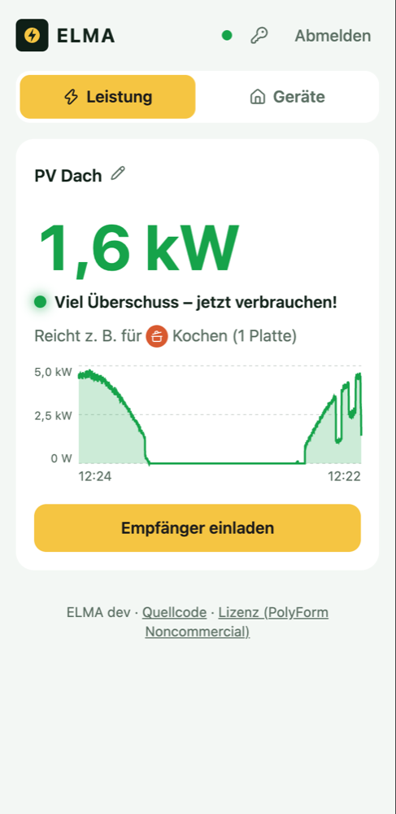
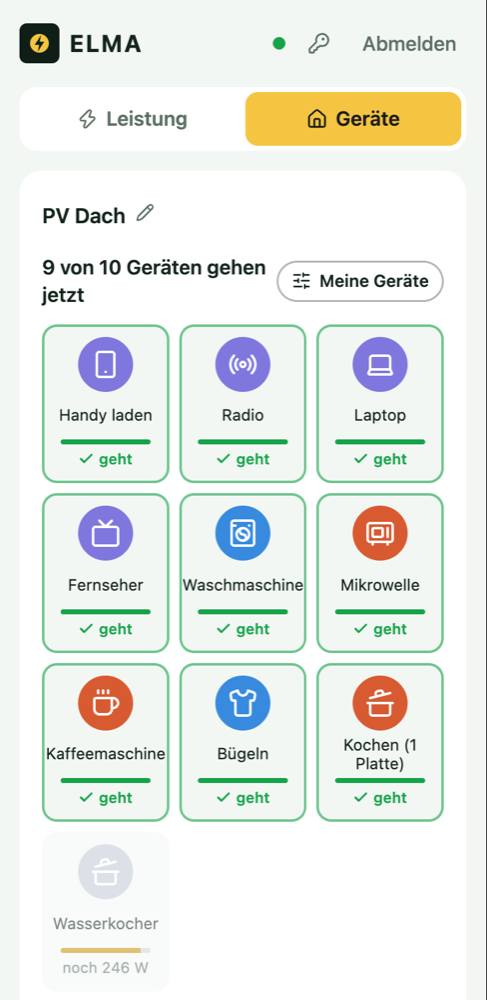
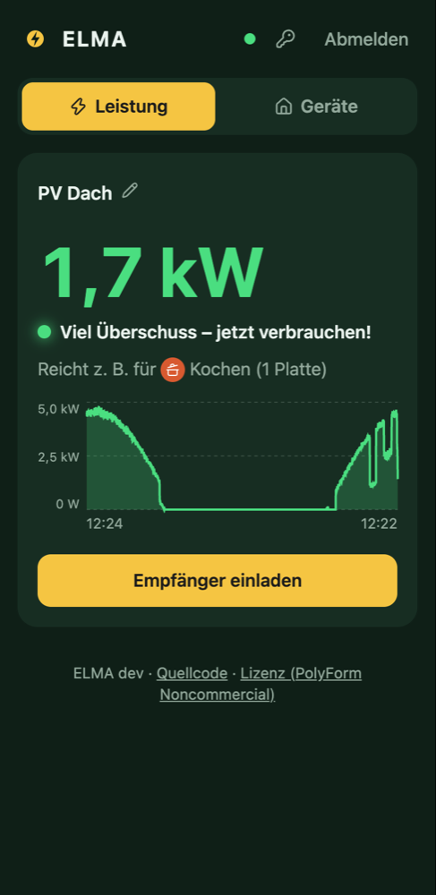

# ELMA – share your solar surplus with the neighbours

[](https://github.com/womat/elma/actions/workflows/ci.yml)
[](LICENSE.md)

🇩🇪 [Deutsche Fassung (ausführlich)](README.md)

*ELMA* stands for *Energie Lokal Miteinander Austauschen*, German for "exchanging energy locally, together".

<p align="center">
  
  &nbsp;
  
  &nbsp;
  
</p>

## The idea

At noon a PV system often produces more power than the household needs. The surplus goes into the grid for a few cents.
Next door, neighbours, family or friends pay the full price for their electricity. They just don't know *when* it would be worth switching on the washing machine.

Since 1 October 2026, Austria allows **peer-to-peer electricity contracts** (P2P, new Electricity Industry Act *ElWG*):
households share self-generated power directly with each other, based on a simple contract.
Energy communities (EEG/BEG) work the same way.
But shared power only counts if the recipient uses it *at the moment* it is produced.

ELMA closes that gap. The producer shares the current surplus, and the recipients see it live on their phones and shift their consumption into that window.
ELMA does not do any billing. That stays with the energy community or the grid operator.

## Features

- **Live surplus:** one big number with a traffic light (plenty / some / none) and a 24-hour chart.
- **Appliances instead of watts:** "✓ washing machine" or "650 W short of the kettle". Everyone picks their own appliances or adds custom ones.
- **Push notifications** once one of your appliances can run, after 2 minutes of stable surplus so passing clouds don't trigger false alarms.
- **Invite by link:** nobody can sign up without an invitation, so the data stays in a small circle.
- **Passkey sign-in:** fingerprint, face or device PIN. There are no passwords.
- **Installable PWA** on Android and iPhone, no app store needed.
- **Runs at home** on a Raspberry Pi and reads the energy manager (e.g. Smartfox) via MQTT, or a Shelly Pro 3EM.
  It is reachable through a Cloudflare Tunnel, so there are no cloud costs and no open ports.
  The backend sits in an internal Docker network with no access to your home network or the internet.

## Architecture

```
[Home network, one Docker host e.g. Raspberry Pi]
  energy manager (MQTT) ──▶ bridge ──WebSocket──▶ backend (API + app) ◀── cloudflared
                                                                           │ (outbound tunnel)
[Internet]                                       https://elma.example.com ◀┘  ◀── phone (PWA)
```

TypeScript monorepo (pnpm): `apps/bridge` (MQTT → watts), `apps/backend` (Fastify + `node:sqlite`, WebSocket, Web Push),
`apps/push-proxy` (egress proxy that only allows the push services), `apps/web` (React PWA), `packages/shared` (types and schemas).

## Try it locally

You only need Docker. Follow [Lokal testen](README.md#lokal-testen-ohne-echten-broker) in the German README.
It boils down to these steps:

```bash
docker compose -f dev/docker-compose.dev.yml up -d --build mosquitto backend
```

```bash
docker compose -f dev/docker-compose.dev.yml exec backend node src/cli.ts create-user me@example.com
```

Open the printed setup link, create a passkey (works on `localhost` without HTTPS), then create a producer, start the bridge and publish a test value, as described there.

## Documentation

The detailed documentation is in German:
[production setup](README.md#produktiv-im-heimnetz), [Cloudflare Tunnel](docs/cloudflare.md), [hosting for others / ELMA box](docs/hosting.md), [changelog](CHANGELOG.md).
Questions in English are welcome as [issues](https://github.com/womat/elma/issues).

## License

ELMA is **source-available** under the [PolyForm Noncommercial License 1.0.0](LICENSE.md). It is free for private use, non-profits, schools, research and public bodies.
Commercial use requires the author's permission.
See [CONTRIBUTING.md](CONTRIBUTING.md) before opening a pull request.

Copyright © 2026 Wolfgang Mathe. Dedicated to my daughter Elisa.
