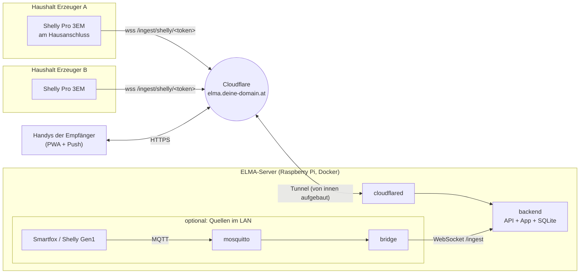
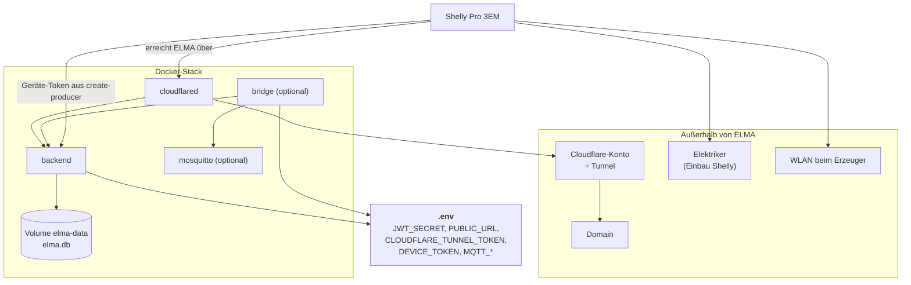
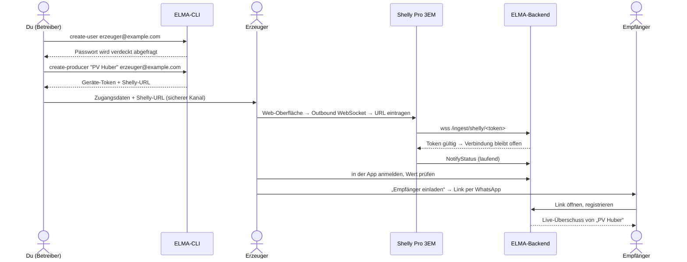
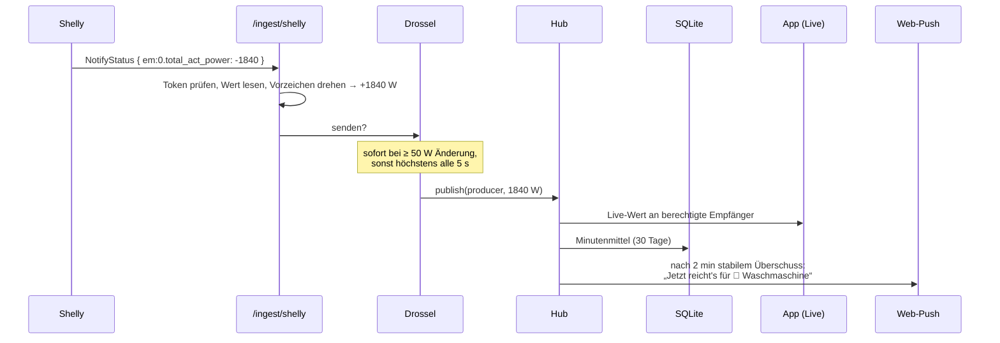
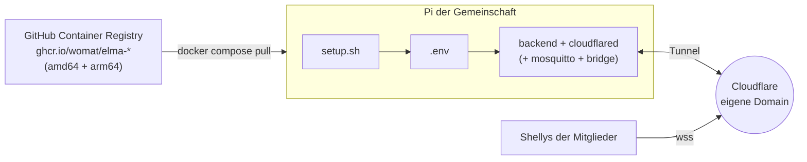

# ELMA für andere bereitstellen

ELMA kann nicht nur den eigenen Überschuss teilen.
Auch andere Haushalte können als **Erzeuger** mitmachen, und zwar auf zwei Arten:

| | **Modell 1: Zentral gehostet** | **Modell 2: Eigene Instanz** |
|---|---|---|
| Wer betreibt den Server? | du, auf deinem Pi (z. B. `my-elma.net`) | die Gemeinschaft selbst, auf ihrem eigenen Pi |
| Was braucht der Erzeuger? | nur einen Shelly Pro 3EM und WLAN | Pi + Shelly + eigene Domain und eigenen Tunnel |
| Wer sieht die Daten? | du als Betreiber und die eingeladenen Empfänger | nur die Gemeinschaft |
| Aufwand für den Erzeuger | sehr gering | mittel, mit Einrichtungsskript |
| Passt für | Nachbarn, Familie, Bekannte | Energiegemeinschaften, die selbst betreiben wollen |

In beiden Modellen kommt der Messwert von einem **Shelly Pro 3EM** am Hausanschluss.

> **Stand:**
> - **Umgesetzt:** Shelly-Endpunkt `/ingest/shelly/<token>`, `rotate-token`, Shelly-URL in `create-producer`, mehrere Erzeuger pro Instanz, Einladungen, MQTT-Bridge.
> - **Geplant:** vorgebaute Images, ELMA-Box mit `setup.sh`.
> - **Offen:** Test mit einem echten Shelly Pro 3EM (siehe [Offene Punkte](#offene-punkte)).

## Messung: Shelly Pro 3EM

Der Shelly Pro 3EM sitzt auf der Hutschiene im Zählerkasten und misst alle drei Phasen am Hausanschluss.
Sein Wert `total_act_power` ist genau das, was ELMA braucht:

- **positiv** = Strom wird aus dem Netz bezogen, es gibt keinen Überschuss
- **negativ** = Strom wird eingespeist, das ist der Überschuss

ELMA dreht das Vorzeichen um, sodass der Überschuss positiv angezeigt wird.
Das ist dieselbe Logik wie beim Smartfox mit `PAYLOAD_INVERT=true`.

> Den Shelly muss ein **Elektriker** einbauen, weil die Stromwandler im Zählerkasten angeklemmt werden.
> Ein Steckdosen-Shelly am Balkonkraftwerk reicht nicht: Er misst nur die Erzeugung, nicht den Überschuss.

### Warum der Shelly direkt mit ELMA spricht

Shellys der Generation 2 und neuer können selbst eine **ausgehende WebSocket-Verbindung** aufbauen.
Darüber schicken sie jede Änderung der Messwerte als JSON-RPC-Nachricht (`NotifyStatus`).

Das hat drei Vorteile:
- Beim Erzeuger läuft **kein Pi, kein MQTT-Broker und keine Bridge**.
- Im Heimnetz des Erzeugers wird **kein Port geöffnet**, weil die Verbindung von innen nach außen geht.
- Die Verbindung läuft über HTTPS/WSS durch den Cloudflare Tunnel, den ELMA ohnehin hat.

Ein zentraler MQTT-Broker wäre schlechter, weil der Cloudflare Tunnel kein rohes MQTT (Port 1883/8883) durchleitet.
Mosquitto bleibt deshalb nur für Quellen im **eigenen LAN**, die nichts anderes können (Smartfox, Shelly Gen1, Wechselrichter).

## Architektur



Jeder Erzeuger hat ein eigenes **Geräte-Token**.
Das Token bestimmt, zu welchem Erzeuger ein Messwert gehört.
Die Empfänger sehen nur die Erzeuger, die sie eingeladen haben.

### Abhängigkeiten



| Baustein | braucht | wofür |
|---|---|---|
| `backend` | Volume `elma-data`, `JWT_SECRET`, `PUBLIC_URL` | Login, Freigaben, Live-Werte, Verlauf, App |
| `cloudflared` | `CLOUDFLARE_TUNNEL_TOKEN`, Domain bei Cloudflare | Erreichbarkeit von außen ohne offene Ports |
| Shelly Pro 3EM | WLAN, Geräte-Token, Einbau durch Elektriker | Messwert des Erzeugers |
| `mosquitto` + `bridge` | `DEVICE_TOKEN`, `MQTT_*` | nur für MQTT-Quellen im eigenen LAN |

## Abläufe

### Neuen Erzeuger aufnehmen (Modell 1)



### Weg eines Messwerts



## Checkliste: Was du tun musst, um andere zu hosten

### Einmalig
- [ ] ELMA mit Shelly-Endpunkt ausrollen (`scripts/deploy.sh`).
- [ ] Prüfen, dass der Cloudflare Tunnel WebSockets auf `/ingest/shelly/*` durchlässt.
  Das ist bei Cloudflare Tunnels Standard, es braucht keine eigene Regel.
- [ ] Backup von `elma-data` einrichten, z. B. täglich `elma.db` kopieren.
  Mit fremden Haushalten liegen dort auch deren Konten.
- [ ] Kurzen Hinweis für Teilnehmer schreiben: welche Daten gespeichert werden (Minutenmittel 30 Tage, E-Mail, Push-Abo), wer Zugriff hat, wie man wieder austritt.
- [ ] Lizenz beachten: Hosting für andere ist erlaubt, solange es **nicht kommerziell** ist (siehe [LICENSE.md](../LICENSE.md)).

### Pro Erzeuger
1. Konto anlegen: `docker compose exec backend node src/cli.ts create-user <email>`
2. Erzeuger anlegen: `docker compose exec backend node src/cli.ts create-producer "<Name>" <email>`.
   Das gibt das Geräte-Token und die fertige Shelly-URL aus.
3. Die URL **nur über einen sicheren Kanal** weitergeben, weil sie das Token enthält.
4. Gemeinsam das Vorzeichen prüfen: Bei Sonne und wenig Verbrauch muss die App einen positiven Überschuss zeigen.
5. Den Erzeuger Empfänger einladen lassen, das macht er selbst in der App.
6. Wenn die URL in falsche Hände gerät: `rotate-token <producerId>` ausführen und die neue URL im Shelly eintragen.

### Laufend
- Health-Check: `https://<domain>/api/health` zeigt Version und Status.
- Updates wie gewohnt mit `scripts/deploy.sh`.
- Backups gelegentlich testweise zurückspielen.

## Shelly einrichten

1. Der Elektriker baut den Shelly Pro 3EM ein. Die Stromwandler kommen in Energierichtung auf L1–L3.
2. Shelly per App oder Web-Oberfläche ins WLAN bringen.
   Die Firmware sollte aktuell sein.
3. In der Web-Oberfläche des Shelly unter **Settings → Outbound WebSocket**:
   - **Enable** einschalten
   - **Server:** die URL aus `create-producer`, z. B. `wss://my-elma.net/ingest/shelly/<token>`
   - **TLS:** „Default CA bundle“ verwenden (`ssl_ca: "ca.pem"`)
4. Speichern. In der ELMA-App erscheint der Wert nach wenigen Sekunden.
5. Bei falschem Vorzeichen sind die Wandler vermutlich verkehrt herum montiert.
   Alternativ kann ELMA später eine Option „Vorzeichen umkehren“ pro Erzeuger bekommen.

Dasselbe per RPC, z. B. aus dem LAN:

```bash
curl -s -X POST http://<shelly-ip>/rpc/Ws.SetConfig -d '{"config":{"enable":true,"server":"wss://my-elma.net/ingest/shelly/<token>","ssl_ca":"ca.pem"}}'
```

## Modell 2: Eigene Instanz (ELMA-Box)

Eine Gemeinschaft betreibt ELMA komplett selbst.
Dabei läuft nichts auf deiner Infrastruktur.



### Hardware

| Gerät | Eignung |
|---|---|
| Raspberry Pi Zero / Zero W (1. Generation) | ❌ ARMv6: kein offizielles Node 24, kaum Docker-Images |
| Raspberry Pi Zero 2 W (512 MB) | ⚠️ Untergrenze: geht nur mit vorgebauten Images, 64-bit-System und Swap; Mosquitto und Bridge nur, wenn nötig |
| Raspberry Pi 4 / 5 (ab 2 GB) | ✅ empfohlen, mit Reserve für Updates und weitere Dienste |

- Betriebssystem: **Raspberry Pi OS Lite 64-bit**.
- Speicher: gute SD-Karte (A1/A2) oder USB-SSD.
  ELMA schreibt nur Minutenmittel, das ist für SD-Karten unkritisch.
- Auf dem Pi wird **nichts gebaut**: Ein Build vor Ort (pnpm + Vite) wäre auf einem Zero 2 W zu langsam und würde am Speicher scheitern.
  Die Images kommen fertig aus der GitHub Container Registry.

### Schritte (geplant)
1. Raspberry Pi OS Lite 64-bit installieren, Docker installieren (`curl -fsSL https://get.docker.com | sh`).
2. Domain bei Cloudflare hinzufügen und unter Zero Trust einen Tunnel anlegen.
   Ziel ist `http://backend:3000`, das Tunnel-Token notieren.
3. `deploy/box/` auf den Pi kopieren und `./setup.sh` starten. Das Skript
   - erzeugt `JWT_SECRET`,
   - fragt `PUBLIC_URL`, Tunnel-Token und Port ab,
   - startet den Stack,
   - legt den ersten Benutzer und Erzeuger an
   - und gibt die Shelly-URL aus.
4. Shelly wie oben einrichten.
5. Updates: `docker compose pull && docker compose up -d`.
6. Backup: Volume `elma-data` sichern.

### Optional: Mosquitto im LAN
Nur für Quellen ohne Shelly-Direktverbindung (Smartfox, Shelly Gen1 …):
- Anmeldung nur mit Passwort (`allow_anonymous false`).
- Port 1883 nur im LAN, **nie** nach außen.
- Die Bridge liest das Topic und schickt die Werte wie bisher an `/ingest` (siehe [README](../README.md#payload-format-einstellen)).

## Sicherheit

- **Geräte-Token in der URL:** Der Shelly kann keinen eigenen Login-Header schicken, deshalb steht das Token im Pfad.
  - Das Backend schreibt den Pfad nur gekürzt ins Log (`/ingest/shelly/***`).
  - In der Datenbank liegt nur der Hash des Tokens.
  - Das Token erlaubt nur, Messwerte für **diesen einen** Erzeuger zu schreiben, nicht das Lesen anderer Daten.
  - Es lässt sich jederzeit mit `rotate-token` tauschen.
- **Keine offenen Ports:** Shelly und cloudflared bauen ihre Verbindungen von innen nach außen auf.
- **Mosquitto** ist nur im LAN erreichbar und nur mit Passwort.
- **Empfänger** kommen nur über einen Einladungslink hinein: Er ist 7 Tage gültig und nur einmal verwendbar.

## Offene Punkte

- **Mit echtem Gerät zu prüfen:**
  - Akzeptiert der Shelly einen Pfad mit Token in der Outbound-WebSocket-URL?
  - Wie oft schickt er `em:0`-Updates?

  Falls nicht: Fallback ist ein kleines Shelly-Script (`HTTP.POST` alle paar Sekunden) an einen REST-Endpunkt mit derselben Auswertung.
- **Selbstregistrierung:** Heute legt der Betreiber Erzeuger per CLI an. Später könnte das in der App gehen.
- **Energiegemeinschaft n:m:** Mehrere Erzeuger für mehrere Empfänger als Gruppe. Das Datenmodell ist dafür vorbereitet.
